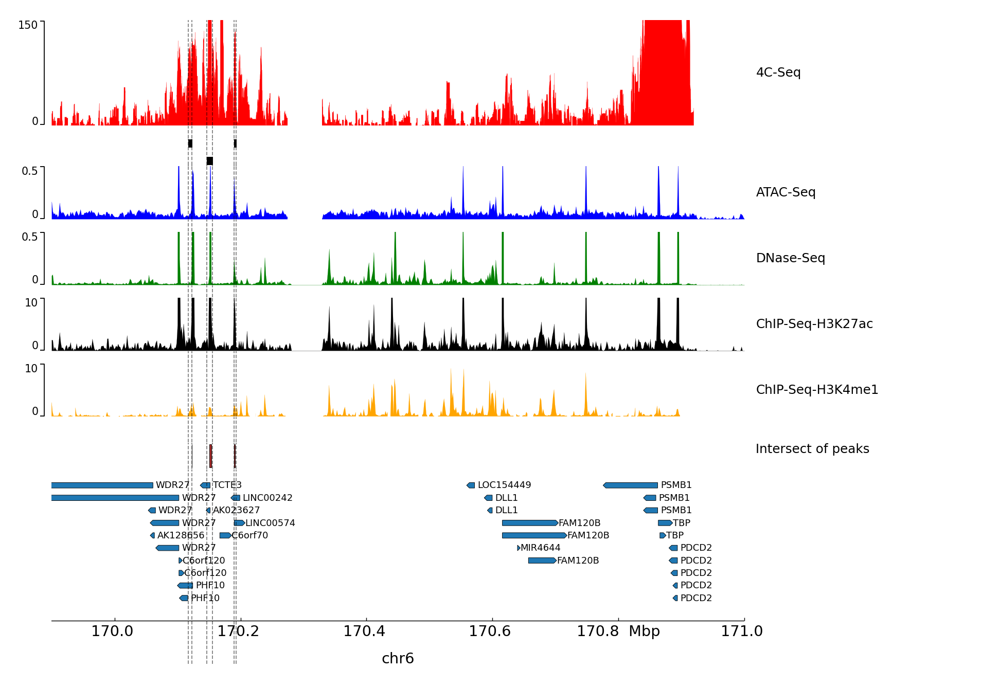

# 4CSeq Enhancer Detection

Discription of pipeline should be added here 





This project has been built on top of the following packages, projects, and repositories:

- pipe4C: https://github.com/deLaatLab/pipe4C
- pyGenomeTracks: https://github.com/deeptools/pyGenomeTracks
- 


## Citation


## Prerequisites

- A Unix like shell (we used Ubuntu 18.04)
- Bowtie2 v2.3+ available from http://bowtie-bio.sourceforge.net/bowtie2/.  (we used version 2.3.4.1 64-bit)
- SAMtools v1.3+ available from http://www.htslib.org/. 
   - **Note:** The pipeline will produce a sort error when older versions are used. (we used samtools 1.7)
- R v3.5+ available from https://www.r-project.org/.
- The following R packages available from CRAN:
  - optparse
  - caTools
  - config
- The following R packages available from Bioconductor:
  - shortRead
  - genomicRanges
  - genomicAlignments
  - BSgenome of interest
- The peakC package available from https://github.com/deWitLab/peakC/.

## Installation Steps

- First, Download the pipe4C and all relevant functionalities:

```
    $ git clone https://github.com/GhorbaniF/4CSeqEnhancerDetection.git
    $ cd 4CSeqEnhancerDetection
    $ unzip pipe4C.zip
    $ cd pipe4C
```
**Note:** the pipe4C.R and functions.R files need to be placed in the same folder. 


- We used index (e.g., CGATGT) in the reverse primers to seperate diffrent genes in one sequence run. Based on this index we seperated the genes. Since for one index, there is four lanes in the sequencing, we have to combine the fastq files for each index:

```
cat *CGATGT*.fq.gz > all_CGATGT.fastq.gz
```

- Since our data is already demultiplexed, we have to run the following commands once just for generating /outF/ folder

```
Rscript pipe4C.R --vpFile=./example/VPinfo.txt --fqFolder=./example/ --outFolder=./outF/ --cores 8 --plot --wig
```

After couple of seconds, we need to stop the process using ctrl+c, and copy our fastq files generated in the previous step to the /outF/FASTQ/ folder. This way, the pipe4C program will use the existing fastq files and does not perform demultiplexing. 

- We finally run the script with our data using the following command:  

```
Rscript pipe4C.R --vpFile=./example/VPinfo.txt --fqFolder=./example/ --outFolder=./outF/ --cores 8 --plot --wig
```

**Notes:** 

- If everything works correctly, we should see the following lines in the terminal: 

```
------ Demultiplexing Fastq files based on VPinfo file
      ### WARNING: File ./outF/FASTQ/all_ACTTGA.fastq.gz exists. continuing with exisiting file.
      ### WARNING: File ./outF/FASTQ/all_CAGATC.fastq.gz exists. continuing with exisiting file.
      ### WARNING: File ./outF/FASTQ/all_GATCAG.fastq.gz exists. continuing with exisiting file.

```

- It is importnat to set the position of choromosom correctly in the VPinfo.txt file, otherwise peakC will not be able to visulize the peaks.

**Table 1.** example of VPinfo.txt file
| expname | spacer | primer | firstenzyme | secondenzyme	| genome	| vpchr	| vppos	| analysis | fastq |
| :---         | :---:  |     :---:  |     :---: |  :---: |  :---: |  :---: |  :---: |  :---: | :---: |
| all_GATCAG   | 0 | TCCAGACAAATAAACATG | NlaIII    | DpnII		   | hg19	| 14		| 92573009	| cis	     | all_GATCAG.fq.gz |
| all_ACTTGA   | 0 | TCCAGACAAATAAACATG | NlaIII    | DpnII		   | hg19	| 14		| 92573009	| cis	     | all_ACTTGA.fq.gz |
| all_CAGATC   | 0 | TCCAGACAAATAAACATG | NlaIII	 | DpnII		   | hg19	| 14		| 92573009	| cis		  | all_CAGATC.fq.gz |

- To set the Y axis of the coverage plots, which are generated in /outF/PLOTS/ folder, we need to edit the relevant parameters at the end of the conf.yml file

- To generate the peakC plot, you need to add a set of addresses in **peakC_analysis.r** file, and run it in Rstudio.


